# Go is bigger than crab!

Ever wanted your custom [Gopher](https://go.dev/blog/gopher) but didn't have the drawing skills?

Well seems now you can generate them.
Type the title into your favorite AI prompt to get this:

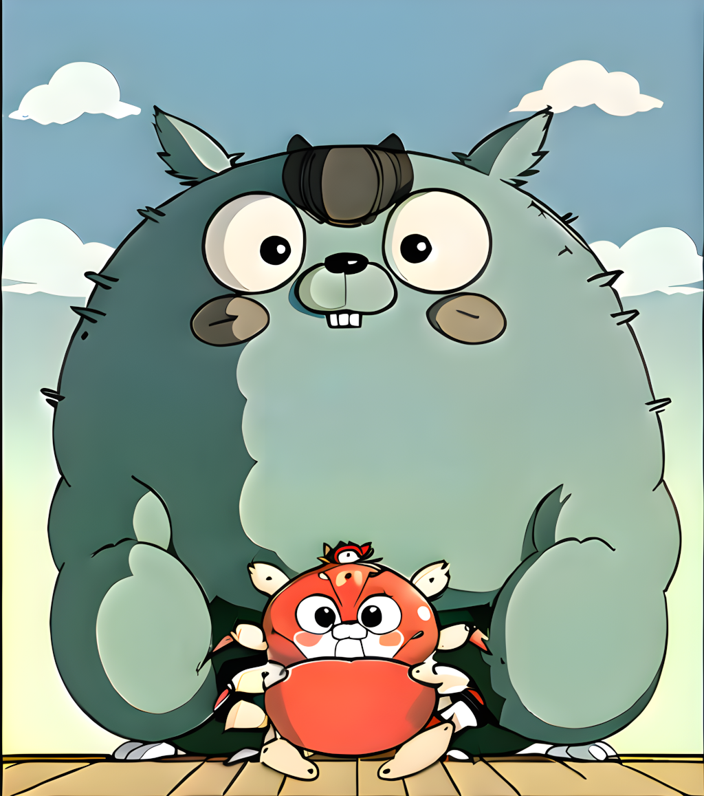

Well no. But it's close enough so let's dive in...

## What you need

1. [**Easy Diffusion**](https://easydiffusion.github.io/)

Which is a 1-click install of [Stable Diffusion](https://github.com/CompVis/stable-diffusion)
 with an alternative web interface.
You can choose a different approach but this one is pretty simple and I am new to this stuff.

> Make sure you meet the hardware requirements (GPU) and have enough disk space (this is a whopping 20+GB install).

2. [**golang gopher**](https://civitai.com/models/125264?modelVersionId=136827)

This one does all the magic to ensure the generated image resembles a gopher.

Place it into `EasyDiffusion/models/lora/`.

3. [**Anything V5/Ink**](https://civitai.com/models/9409)

By pure chance, I used this model instead of the default one and it gave amazing results.
If you are looking for the classic gopher style use the default (`sd-v1-5`), but this one is more fun.

Place it into `EasyDiffusion/models/stable-diffusion/`.

> It tends to give the gophers a bit of a teddy bear look though so experiment with the settings
> and regenerate until you get something that pleases you.

4. [**Studio Ghibli Style LoRA**](https://civitai.com/models/6526?modelVersionId=7657)

This one is optional but also has some nice effects when adding it into the mix.

Place it into `EasyDiffusion/models/lora/`.

> See [What are LoRA models and how to use them in AUTOMATIC1111](https://stable-diffusion-art.com/lora/) for the difference between LoRa and base models.

### Example

- sd (top-left)
- sd+gopher (top-right)
- anything+gopher (bottom-left)
- antything+gopher+ghibli (bottom-right)

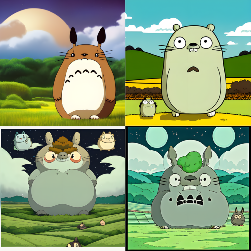

## Settings

Start `Easy Diffusion` and it should open [http://localhost:9000/](http://localhost:9000/) in your browser.

### Network access

Under `Settings` you can configure it to allow remote access.

> It is **NOT SECURED** so best to only do this in a safe local environment.

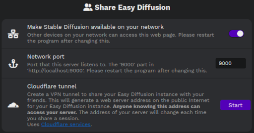

### Image

- **Seed**: `Random` for new creations.
- **Number of Images**: `4` to have some options to choose from.
- **Model**: `AnythingV5Ink_ink` or keep the standard model.
- **Image Size**: `512x512` is fine for the usual gopher image as we can upscale it later but you can choose a different format.
- **LoRa**: `gophers_v1 [0.5]` and optionally `ghibli_style_offset [0.5]` as well
- **Output Format**: `png`

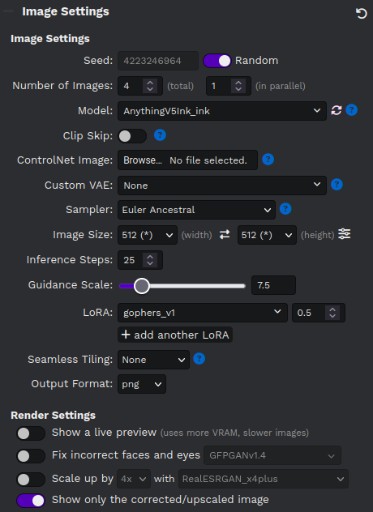

> Images are **NOT STORED** by default and closing the browser tab causes loss of data.
> So often save the generated `image` and `json`.
> You can do this by highlighting it and clicking the corresponding button.
> Or download the full set with `Download images` at the top.

## The Prompt

In the Prompt, you can add a comma-separated list of keywords of what you want in the image.
You can also emphasize specific keywords with brackets (e.g. `(coffee)` or `(holding a mug)`).

Be sure to add one of `golangGopher` (recommended), `gopherArt`, `gopherCircle` or `gopher3d` for the gopher model.

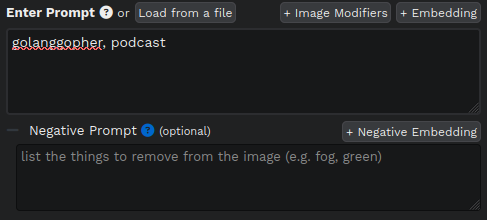

> Have a look at the [Prompt Guide](https://stable-diffusion-art.com/prompt-guide/) for advanced techniques.

There is also the `Negative Prompt` where you can define what you **don't** want in the image.
You may add `rust, ferris` here, but best to leave this for later when you want to get rid of something specific.

## The first try

Fill the prompt with `golanggopher, <keywords...>` and hit `Make`.

Here's what I got for `golanggopher, podcast`:

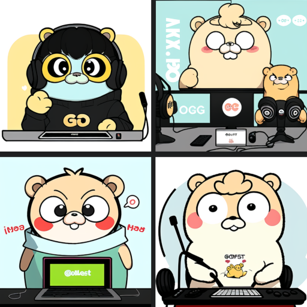

> If there is nothing of interest try again.
> But if one has a nice theme or composition don't start from zero.
> Highlight the image and click `Make Similar Images` to use it as input.

In my case, the upper left already looks pretty nice, but there are some issues...

## Fixing the teeth

See how there are no teeth? This happens pretty often when they are missing or not right.
Highlight the image and click `Use as Input`.

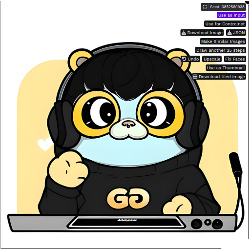

> If you've done something else in the meantime you should select `Use these settings` on the top right first.

Klick `Inpaint`.

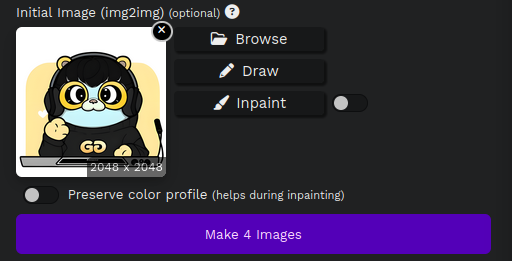

Mask the part to regenerate.

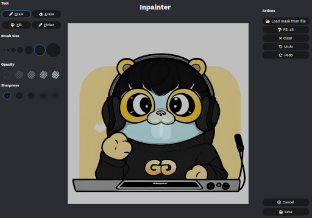

Save it, hit `Make` and if you're lucky that fixes it.

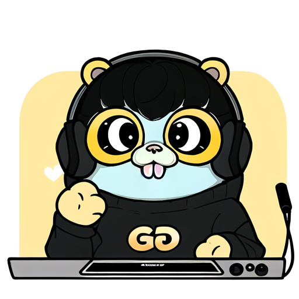

> If it didn't work you can try to add `teeth` to the prompt.
> Otherwise set the `seed` to random and try again.
> It is also possible to `Draw` (above `Inpaint`) on the image some rough sketches for guidance.

## Fixing the logo

The logo looks okay, but it isn't an `O`.
It's pretty close though, so mask the part that doesn't fit.

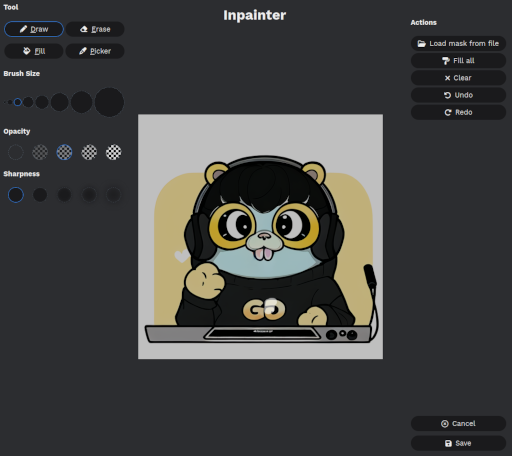

This one worked on the first try.

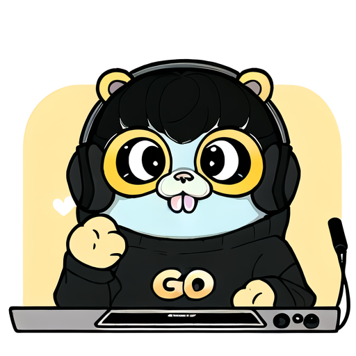

## Upscale

Finally, highlight the image and click `Upscale` for a higher resolution.
Then highlight it again to save it with `Download Image`.

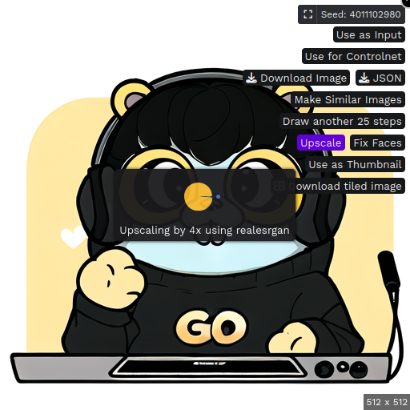

## So what about the big one above

That is a composition of two generated images.

The big one (`golanggopher, studio ghibli, totoro`):

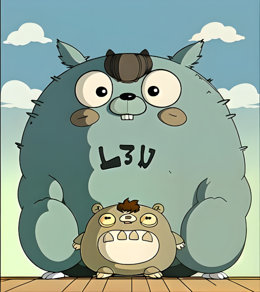

The small one (`golanggopher, crab`):

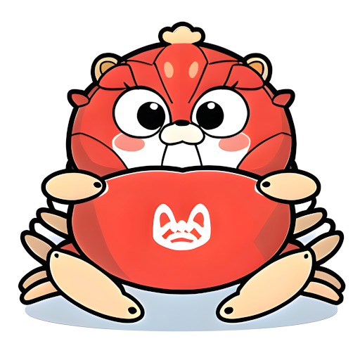

- By removing the background.
- Placing it over the other image.
- Overpainting parts of the old gopher.
- Importing it in `Easy Diffusion` as `Input`.
- Masking the outline for inpainting.
- And letting it regenerate various parts a couple of iterations.
- It ended up as above.

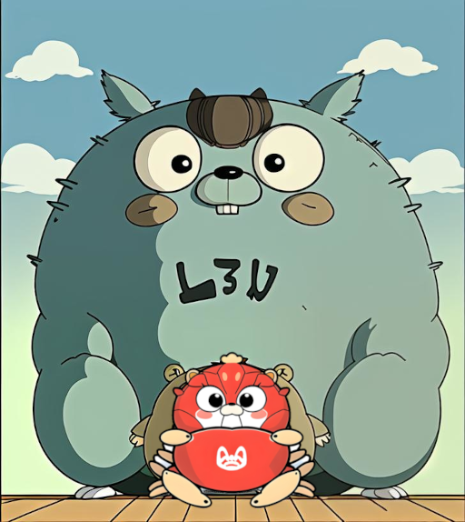

## Examples

You can find some examples at [https://github.com/rsteube/gopher](https://github.com/rsteube/gopher).

Have fun!

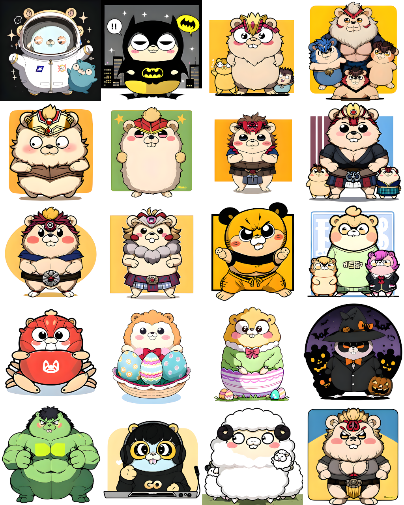
