# Puking Rainbows


Shells support colored output. Some do so also during tab completion.

It can provide extra context like whether an issue is **open** (green) or **closed** (red).
Or reflect the color of labels:

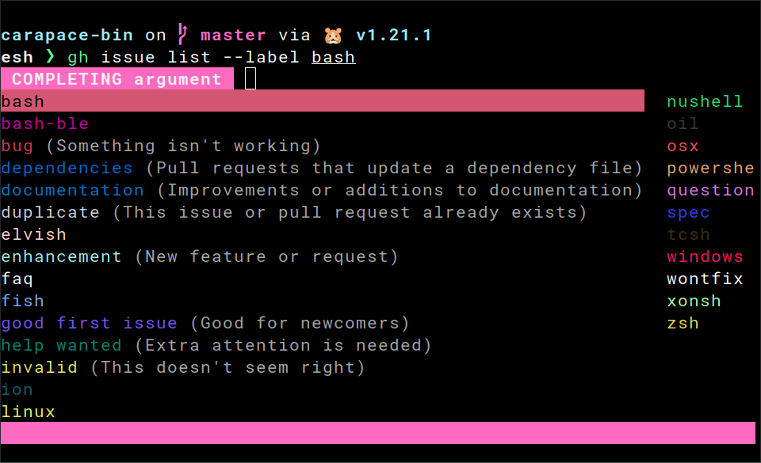

Here is how this works and how it is done in [carapace]...

## ANSI escape sequences

Text style is set in the shell using an escape sequence like `\e[31;42m`.
This instructs the terminal that the text following it is **red** (31) with a **green background** (41).

It consists of
- `\e` escape.
- `[` an opening square bracket.
- `31;42` a semicolon-separated list of escape codes.
- `m` the letter m.

A common approach is to restore the default style using `\e[0m` afterwards.

```sh
echo "\e[1;2;4;35mdim bold underlined magenta\e[0m" # you might need `echo -e` for this
```

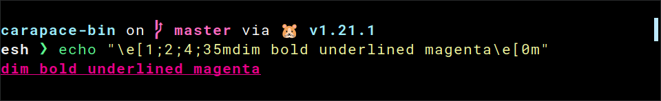

There are basic **foreground colors** (30-37), **background colors** (40-47),
**modes** (1-9) and **reset** (0) to restore the default. **256-colors**
 and **RGB** are also possible.

> You can find a full list at [ANSI Escape Sequences](https://gist.github.com/fnky/458719343aabd01cfb17a3a4f7296797).

## Elvish

This one is easy.

### Styled

[Elvish] provides an abstraction for escape sequences using a list of human-readable keywords.

```sh
echo (styled "dim bold underlined magenta" dim bold underlined magenta)
```

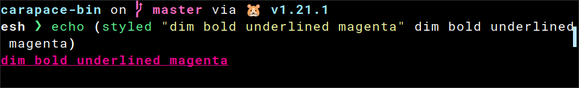

> You can read more about this at [styled](https://elv.sh/ref/builtin.html#styled).

### Complex candidate

Adding colors to tab completion is thus pretty easy with [edit:complex-candidate](https://elv.sh/ref/edit.html#edit:complex-candidate).

```sh
set edit:completion:arg-completer[example] = {|@args|
  edit:complex-candidate true &display=(styled true green)' (true in green)'
  edit:complex-candidate false &display=(styled false red)' (false in red)'
}
```

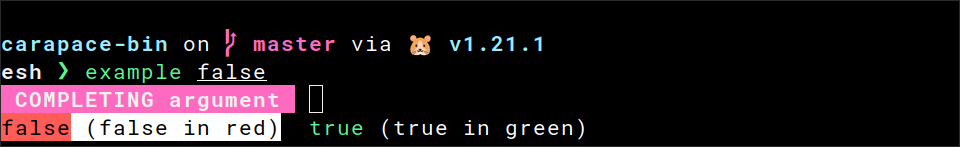

## Powershell

This one is a bit tricky.

### Backtick

First of all, the escape character is different in [Powershell].
It uses **backtick** instead of **backslash**.

```sh
echo "`e[1;2;4;35mdim bold underlined magenta`e[0m"
```

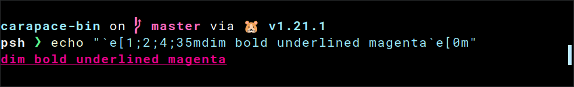

### Completion result

[CompletionResult] allows escape sequences in the `ListItemText` to add color.

```sh
Function _example_completer {
    [CompletionResult]::new("false", "`e[31mfalse`e[0m", [CompletionResultType]::ParameterValue, "false in red")
    [CompletionResult]::new("true", "`e[32mtrue`e[0m", [CompletionResultType]::ParameterValue, "true in green")
}
Register-ArgumentCompleter -Native -CommandName 'example' -ScriptBlock (Get-Item "Function:_example_completer").ScriptBlock
```

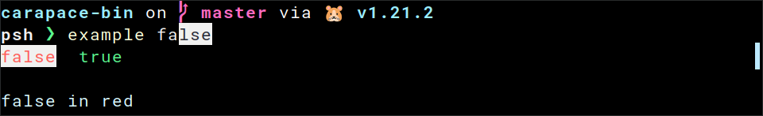

By default, it uses tooltips to show the descriptions.
But the value by itself often gives no sign of what it represents.

### ListItemText

Luckily, we can add the description to the `ListItemText` ourselves.

```sh
Function _example_completer {
    [CompletionResult]::new("false", "`e[31mfalse`e[0m (false in red)", [CompletionResultType]::ParameterValue, " ")
    [CompletionResult]::new("true", "`e[32mtrue`e[0m (true in green)", [CompletionResultType]::ParameterValue, " ")
}
Register-ArgumentCompleter -Native -CommandName 'example' -ScriptBlock (Get-Item "Function:_example_completer").ScriptBlock
```

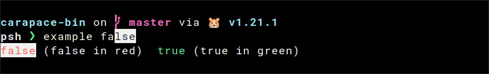

> Tooltip **must not** be empty though, so we need to set it to a single space.

### Selection

Fix the highlighting by setting [`Selection`](https://learn.microsoft.com/en-us/powershell/module/psreadline/set-psreadlineoption#-colors) to inverse.

```sh
Set-PSReadLineOption -Colors @{ "Selection" = "`e[7m" }
```

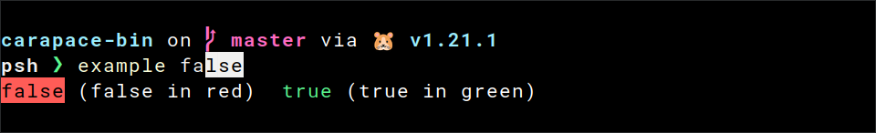

### Description

And add some finishing touches to the description.

```sh
Function _example_completer {
    [CompletionResult]::new("false", "`e[21;22;23;24;25;29m`e[31mfalse`e[21;22;23;24;25;29;39;49m`e[2m `e[2m(false in red)`e[21;22;23;24;25;29;39;49m`e[0m", [CompletionResultType]::ParameterValue, " ")
    [CompletionResult]::new("true", "`e[21;22;23;24;25;29m`e[32mtrue`e[21;22;23;24;25;29;39;49m`e[2m `e[2m(true in green)`e[21;22;23;24;25;29;39;49m`e[0m", [CompletionResultType]::ParameterValue, " ")
}
Register-ArgumentCompleter -Native -CommandName 'example' -ScriptBlock (Get-Item "Function:_example_completer").ScriptBlock
```

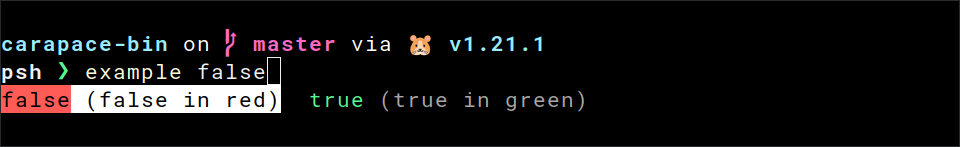

## Zsh

This one is hard.

### Arrangement

First, let's have a look at how [Zsh] arranges values for tab completion.
- Values **without a description** are arranged side-by-side.
- Values **with a description** have it appended in the format ` -- description`
  It is also aligned with other entries.
- Values **with the same description** are also arranged side-by-side in front of the description.

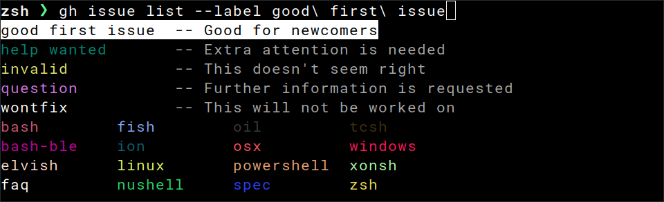

### Zstyle

Colors are set using the [zstyle] `list-colors`.

With `${curcontext}` we can configure it for the current context during tab completion.

```sh
zstyle ":completion:${curcontext}:*" list-colors "{...}"
```

### List Colors

It contains a colon-separated list of **patterns** and **formats**.
Formats are the semicolon-separated escape codes from [ANSI escape sequences](#ansi-escape-sequences).

There is a **simple** and a **complex** way to specify the patterns.
- `=pattern=format` to apply one format.
- `=(#b)(pattern1)(pattern2)=format0=format1=format2` to apply many formats.

> See [here](https://stackoverflow.com/a/23568183) for a good explanation.

### Pattern

Given the value "true", three patterns are relevant.

- `=(#b)(true)=0=32` Set "true" to **green** (32).
- `=(#b)(true)([ ]## -- *)=0=32=2` Set "true" to **green** (32) and the description to **dim** (2).
- `=(#b)(-- *)=0=2` Set the description to **dim** for everything else.

> Take this with a grain of salt, but there was an edge case in regards to the arrangement.
> So it's best to set both the pattern for **with** and **without** a description for each value.


### Compdef

Putting it all together.

```sh
#compdef example
function _example_completion {
  zstyle ":completion:${curcontext}:*" list-colors "=(#b)(false)([ ]## -- *)=0=31=2:=(#b)(false)=0=31:=(#b)(true)([ ]## -- *)=0=32=2:=(#b)(true)=0=32:=(#b)(-- *)=0=2"
  
  vals=('true:true in green' 'false:false in red')
  _describe 'values' vals
}
compquote '' 2>/dev/null && _example_completion
compdef _example_completion example
```

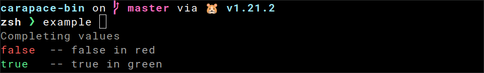

## Carapace

Now to how [carapace] simplifies the above.

### Style

[Styles](https://pkg.go.dev/github.com/rsteube/carapace/pkg/style#pkg-variables) are adopted from [Elvish].
There are colors like `style.Red`, modes like `style.Dim` and `style.Of` to combine them.

### Action

They can be set directly with [ActionStyledValues] and [ActionStyledValuesDescribed].

```go
carapace.ActionStyledValues(
	"true", style.Green,
	"false", style.Red,
)

carapace.ActionStyledValuesDescribed(
	"true", "true in green", style.Green,
	"false", "false in red", style.Red,
)
```

### Modifier

Or with the modifiers [Style], [StyleR] and [StyleF].

```go
carapace.ActionValues(
	"1",
	"true",
).Style(style.Green)

carapace.ActionValues(
	"0",
	"false",
).StyleR(&style.Carapace.KeywordNegative)

carapace.ActionValues(
	"true",
	"false",
	"unknown",
).StyleF(func(s string, sc style.Context) string {
	switch s {
	case "true":
		return style.Green
	case "false":
		return style.Red
	default:
		return style.Default
	}
})
```

### Style functions

The following functions can be passed to [StyleF] for common highlighting tasks:

- [ForPath] highlights paths using the `LS_COLORS` environment variable.

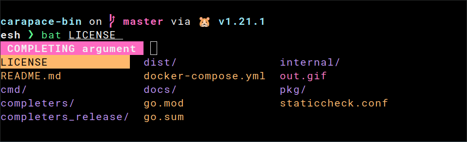

- [ForPathExt] does the same, but by extension only.

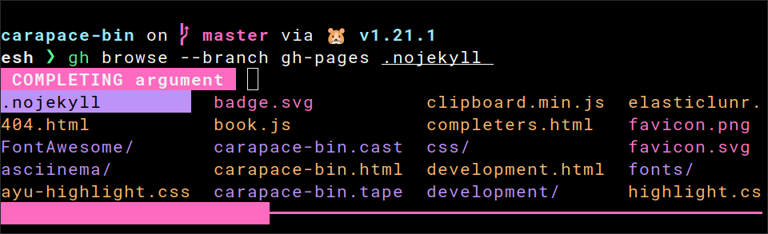

- [ForLogLevel] highlights log levels.

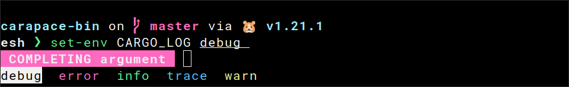

- [ForKeyword] highlights common keywords like **true** and **false**.

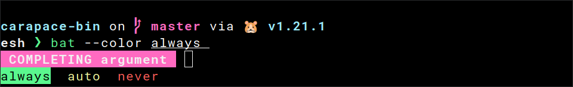

---

## That's all

Enjoy the rainbow!

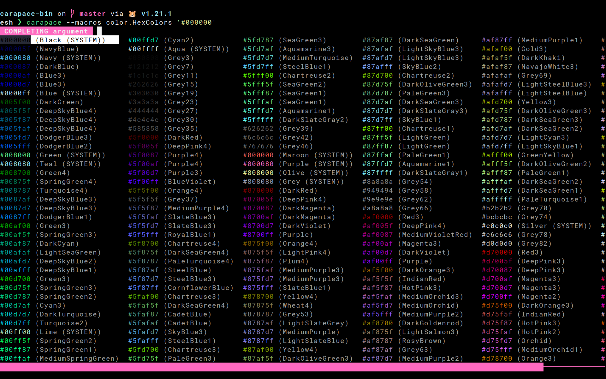


[carapace]:https://github.com/rsteube/carapace
[Elvish]:https://elv.sh/
[Powershell]:https://learn.microsoft.com/en-us/powershell/
[Zsh]:https://www.zsh.org/


[ActionStyledValues]:https://rsteube.github.io/carapace/carapace/defaultActions/actionStyledValues.html
[ActionStyledValuesDescribed]:https://rsteube.github.io/carapace/carapace/defaultActions/actionStyledValuesDescribed.html

[Style]:https://rsteube.github.io/carapace/carapace/action/style.html
[StyleF]:https://rsteube.github.io/carapace/carapace/action/styleF.html
[StyleR]:https://rsteube.github.io/carapace/carapace/action/styleR.html

[ForKeyword]:https://pkg.go.dev/github.com/rsteube/carapace/pkg/style#ForKeyword
[ForLogLevel]:https://pkg.go.dev/github.com/rsteube/carapace/pkg/style#ForLogLevel
[ForPath]:https://pkg.go.dev/github.com/rsteube/carapace/pkg/style#ForPath
[ForPathExt]:https://pkg.go.dev/github.com/rsteube/carapace/pkg/style#ForPathExt


[CompletionResult]:https://learn.microsoft.com/en-us/dotnet/api/system.management.automation.completionresult

[zstyle]:https://zsh.sourceforge.io/Doc/Release/Zsh-Modules.html#The-zsh_002fzutil-Module